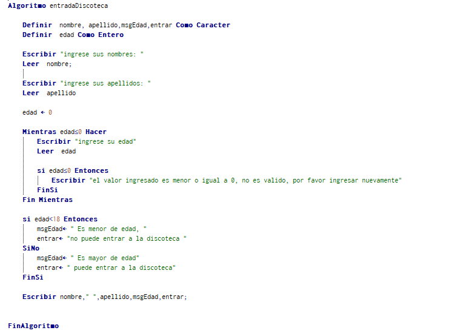
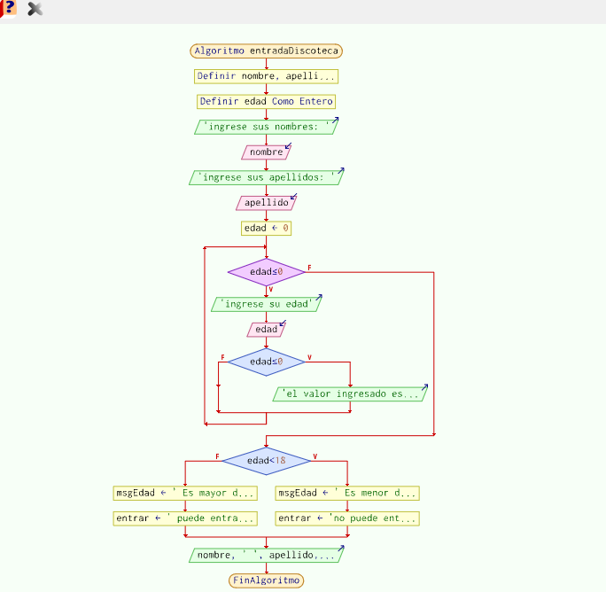
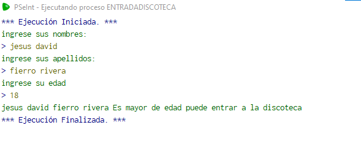

# Tarea
## Solucion
1. ### entrada a la discotega
las discotecas, por lo general no tiene un sistema real de verificacion de ingreso al establecimiento. el dia de hoy les vengo a ofrecer una solucion.
### Mision
> hacer que las discotecas tengan un sistema de registro el cual sirva para verificar con datos reales que las persona que entra es mayor de edad a su vez sepa su nombre completo, con esto podrian tener un control mas ordenado y evitar problemas legales a un precio muy bajo y con un sistema facil de manejar.
### vision
> al plazo de 4 años tener funionando nuestro sistema en la mayor cantidad de discotecas del pais y con esto mejorar tener un impacto para bien a la juventud a la vez que mejorar el servicio en esos establecimientos.
### codigo del programa

### Codigo Diagrama de flujo

### Codigo muestra

2. ### ordenar de mayor a menor
Creamos este programa como modo de enseñanza para los niños, adquiriendo el conocimiento y la capacidad como y porque se organiza los numeros de esa manera
### Mision
> enseñar a los niños de mi pais, como organizar los numeros de mayor a menor respectivamente, al igual que aprenden a usar los (<>) mayor que y menor que  facilitando a su vez el aprendizaje a los docentes y el interes de los niños a la informatica.
### vision
> al plazo de 4 años tener funionando nuestro sistema en la mayor cantidad de colegios y escuelas del pais y con esto mejorar tener un impacto para bien a la juventud a la vez que mejorar el aprendizaje de los niños.
### codigo del programa

